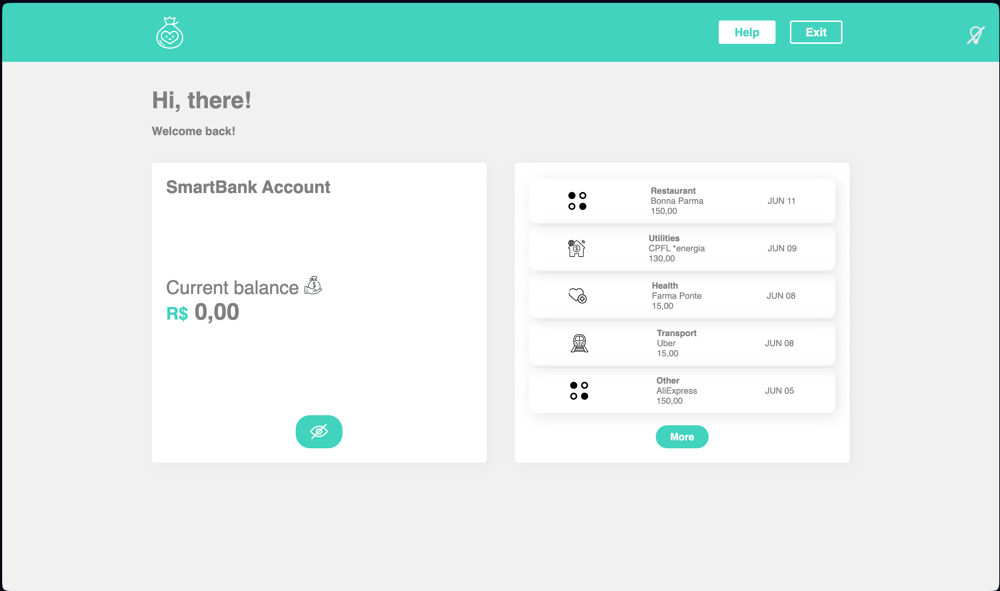

# SmartBank ReactJS Project

A React-based app that simulates a smart bank account interface, including functionalities for account balance, transaction history, and theme switching between light and dark modes.

## Features

- **Account Balance Toggle**: A feature to toggle the visibility of the current account balance.
- **Theme Switcher**: Allows users to toggle between light and dark modes.
- **Transaction History**: Displays recent transactions in a list with icons for different types (e.g., restaurant, utilities, etc.).
- **Responsive Layout**: A design that adapts to different screen sizes for better user experience.
- **Custom Components**: Includes reusable components like buttons, headers, and cards styled with `styled-components`.

## Screenshot



## Installation

1. Clone the repository:
   ```bash
   git clone https://github.com/sarahcalbez/smartbank_reactjs.git

2.	Navigate to the project folder:

    ```bash
    cd smart-bank-app
    ````
3.	Install dependencies:
    ```bash
    npm install
    ````
4.	Start the development server:
    ```bash
    npm start
    ````

## Technologies Used

- **React:** A JavaScript library for building user interfaces.
- **Styled Components:** For styling the components using tagged template literals.
- **React Router:** For handling navigation within the app.
- **Date-fns:** For date formatting.
- **Phosphor Icons:** For interactive icons like trash and applaud.

## Contributing

1.	Fork the repository.
2.	Create your feature branch (git checkout -b feature-name).
3.	Commit your changes (git commit -am 'Add new feature').
4.	Push to the branch (git push origin feature-name).
5.	Create a new Pull Request.

## License

This project is available for free access and use for educational purposes.
